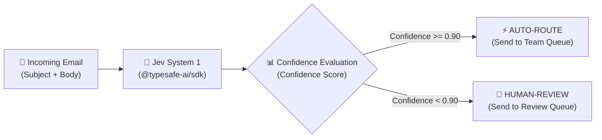

# 📬 Jev Email Classification & Policy Routing Demo

A hands-on starter demo showcasing how to use **Jev** via the [`@typesafe-ai/sdk`](https://www.npmjs.com/package/@typesafe-ai/sdk) to classify incoming customer support emails, generate calibrated confidence scores and probability distributions, and execute automated, policy-gated routing.

---

## 🌟 Overview

When building AI-powered customer support and workflow automation, traditional LLM generation can be slow, unpredictable, or difficult to reliably gate with confidence thresholds.

**Jev** provides deterministic, probabilistic decision-making through fast System 1 queries:
- **Calibrated Confidence**: Know exactly how confident the model is (0.0 to 1.0).
- **Full Probability Distributions**: Inspect candidate probabilities across all defined categories.
- **Deterministic Choices**: Constrain AI output strictly to the allowed category set.
- **Safe Automation Policies**: Auto-route when confidence is high (e.g., $\ge 90\%$), or fallback to human review when ambiguous.

---

## 🏗️ Architecture & Workflow



---

## 📁 Project Structure

```text
jev-email/
├── src/
│   ├── email.ts      # Sample dataset of test emails with expected labels
│   ├── jev.ts        # Jev client initialization and category choice definition
│   ├── policy.ts     # Business logic for confidence-based routing
│   └── index.ts      # Demo runner: executes classification and prints results
├── .env.example      # Template for environment variables
├── package.json      # Dependencies and scripts
└── tsconfig.json     # TypeScript configuration
```

---

## 🚀 Getting Started

### 1. Prerequisites
- **Node.js**: v18.0.0 or higher
- **npm** or **pnpm** / **yarn**
- **TypeSafe / Jev API Key**: Obtainable from the TypeSafe AI platform.

### 2. Installation

Clone the repository and install dependencies:

```bash
git clone <your-repo-url>
cd jev-email
npm install
```

### 3. Configure Environment Variables

Copy `.env.example` to `.env` and add your API key:

```bash
cp .env.example .env
```

Edit `.env`:
```env
TYPESAFE_API_KEY=your_typesafe_api_key_here
```

### 4. Run the Demo

Execute the test suite with hot-reloading:

```bash
npm run dev
```

---

## 💻 Step-by-Step Implementation Guide

Follow these steps to implement Jev classification in your own TypeScript or JavaScript application:

### Step 1: Install the SDK

```bash
npm install @typesafe-ai/sdk dotenv
```

### Step 2: Initialize the Client & Define Choices

Define the classification categories using `choice()` and pass natural language definitions for each option.

```typescript
// src/jev.ts
import { choice, TypeSafeClient } from "@typesafe-ai/sdk";

const client = new TypeSafeClient();

export async function classifyEmail(subject: string, body: string) {
  const response = await client.systemOne({
    state: {
      email: `
        Subject: ${subject}
        Body: ${body}
      `,
    },
    questions: {
      category: choice(
        "What is the main category of this customer email?",
        {
          billing: "Payment, invoice, charge, refund, subscription billing, or incorrect payment.",
          technical: "Technical problem, login issue, bug, integration problem, or product malfunction.",
          sales: "Pricing inquiry, upgrade interest, purchase intent, enterprise plan, or sales opportunity.",
          complaint: "Customer dissatisfaction where the primary issue is poor service or negative experience.",
          spam: "Spam, scam, phishing, malicious, irrelevant advertising, or unsolicited content.",
          other: "The email does not clearly belong to any of the other categories.",
        }
      ),
    },
  });

  return response.answers.category;
}
```

### Step 3: Implement Policy & Routing Rules

Use the returned `confidence` score to make deterministic routing decisions:

```typescript
// src/policy.ts
export function decideRouting(choice: string, confidence: number) {
  // Only auto-route if the model is at least 90% confident
  if (confidence >= 0.9) {
    return {
      action: "AUTO-ROUTE",
      destination: choice,
    };
  }

  // Escalate ambiguous or low-confidence requests
  return {
    action: "HUMAN-REVIEW",
    destination: "review",
  };
}
```

### Step 4: Run Classification & Handle Results

```typescript
// src/index.ts
import "dotenv/config";
import { classifyEmail } from "./jev";
import { decideRouting } from "./policy";

const subject = "Duplicate charge";
const body = "I was charged twice for my subscription this month. Please refund.";

const result = await classifyEmail(subject, body);
const routing = decideRouting(result.choice, result.confidence);

console.log("Selected Category:", result.choice);          // e.g. "billing"
console.log("Confidence:", result.confidence);              // e.g. 1
console.log("Probabilities:", result.probabilities);        // e.g. { billing: 1, technical: 0, ... }
console.log("Routing Action:", routing.action);             // "AUTO-ROUTE"
console.log("Destination:", routing.destination);           // "billing"
```

---

## 📊 Sample Output Walkthrough

When running `npm run dev`, you will see structured evaluations for each email:

### Clear-Cut Example (High Confidence)
```text
===============================
Email ID: 1
Subject: Duplicate charge
Body: 
I was charged twice for my subscription this month.
Please refund the duplicate charge.
    
Expected:  billing
Jev choice:  billing
Jev confidence:  1
Jev probabilities:  { complaint: 0, sales: 0, other: 0, technical: 0, spam: 0, billing: 1 }
Action:  AUTO-ROUTE
Destination:  billing
===============================
```

### Mixed-Intent / Ambiguous Example (Handling Distribution)
```text
===============================
Email ID: 6
Subject: Need help
Body: 
I'm thinking about upgrading to enterprise,
but I also noticed an incorrect charge on my account.
Can someone contact me?
    
Expected:  billing
Jev choice:  billing
Jev confidence:  0.9
Jev probabilities:  {
  spam: 0,
  technical: 0,
  other: 0.02,
  sales: 0.06,
  billing: 0.92,
  complaint: 0
}
Action:  AUTO-ROUTE
Destination:  billing
===============================
```
> **Notice**: Email ID 6 mentions both upgrading (sales) and an incorrect charge (billing). Jev provides the exact probability split (`92%` billing, `6%` sales, `2%` other), allowing you to see nuanced classification in real-time.

---

## 🛠️ Customization & Next Steps

1. **Add Custom Categories**: Add or adjust category keys and descriptions in `src/jev.ts` to fit your business domain (e.g., `returns`, `partnerships`, `security`).
2. **Tune Confidence Thresholds**: Modify the confidence cutoff in `src/policy.ts` (e.g., require `0.95` for auto-executing financial refunds vs `0.80` for routing general inquiries).
3. **Integration**: Connect the classification pipeline directly to your incoming email webhook (SendGrid, AWS SES, Gmail API) or helpdesk API (Zendesk, Linear, Jira).

---

## 📄 License

This project is licensed under the ISC License.
